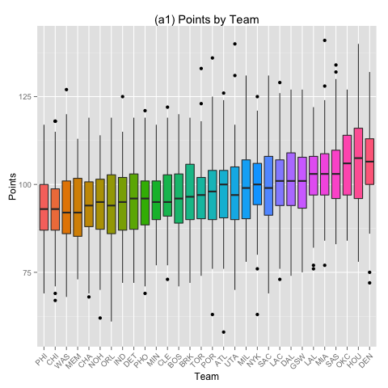
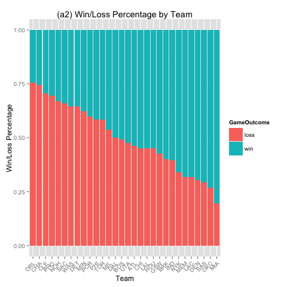
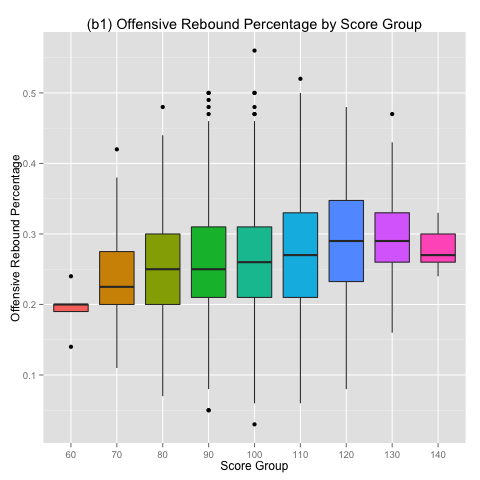
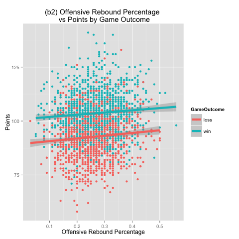
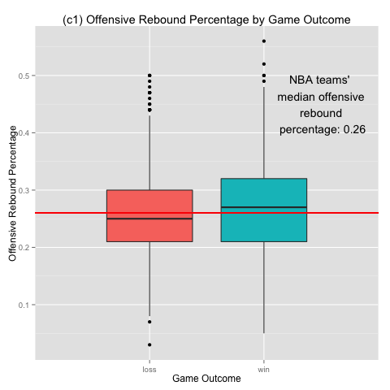
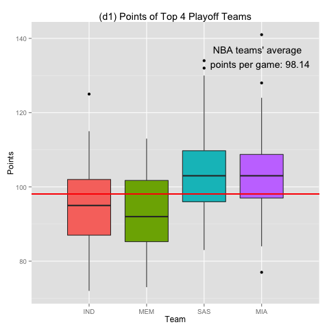
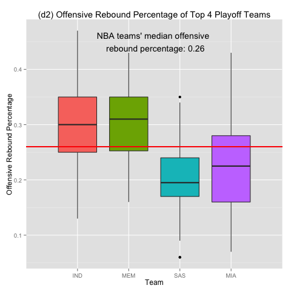
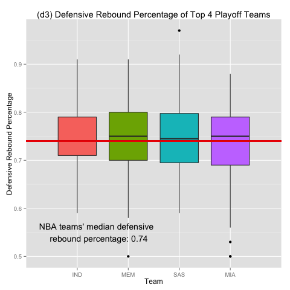

<h1>Should Teams Actively Pursue Offensive Rebounds?</h1>

<h2>Introduction</h2>
There exists a controversial notion among basketball athletes, coaches, and fans that actively going after the ball after missed shots (i.e. actively pursuing offensive rebounds) can do more harm than good. The logic is that active offensive rebound attempts hinder the team's ability quickly get back on defense and create easy fast break opportunities for the opponent team. During the 2012 - 2013 season, NBA's two superstars from the Miami Heat, LeBron James and Dwyane Wade, were well known for their sensational duo fast break tactic, in which one player would throw a long football-like pass to the other end of the court, and the receipient player would easily score by taking advantage of opponent teams that failed to get back on defense quickly.

To shed some insight into this matter, this data analysis was conducted to determine if a team's offensive rebound percentage positively correlated with other variables such as the team's points and its opponent's offensive performance (points, field goal percentage, and free throw attempts). In addition, the top four playoff teams that contended for the season's championship title were selected, and their offensive and defensive performances were examined to better understand the value of offensive rebounds.

<h2>Disclaimer</h2>
This is a descriptive/correlational study. Hence, it is not an experimental research. No manipulation of an independent variable or control of extraneous variables took place for this study. Please note that correlation does not imply causation.

<h2>Methods</h2>
<h3>Tool</h3>
This study was performed using the <a href='http://www.r-project.org/' target='_blank'>R programming language</a>.

<h3>About the Data</h3>
The original data contained information about all 2012 - 2013 season NBA games, with each row that logged various measures of contributions from a single player. This dataset was processed to create a new dataset, <strong>teamsData</strong>, that logged team's collective metrics (instead of individual players') in each row. The new dataset was saved as <strong>teamsData.RData</strong> inside a folder with the following path from this project's working directory: './data/processedData'. 

<table>
	<tr>
		<th>Columns from the original players' dataset</th>
		<th colspan='2'>Newly created, corresponding columns in the teams' dataset</th>
		<th>Description</th>
	</tr>
	<tr>
		<td>N/A</td>
		<td>NumPlayers</td>
		<td>OpponentNumPlayers</td>
		<td>Total number of players who played in the game for the team (not including the opponent team)
	<tr>
		<td>Game.ID</td>
		<td colspan='2'>GameID</td>
		<td>Game ID unique to a single game</td>
	</tr>
	<tr>
		<td>Team</td>
		<td>Team</td>
		<td>OpponentTeam</td>
		<td></td>
	</tr>
	<tr>
		<td>Player</td>
		<td colspan='2'>N/A</td>
		<td></td>
	</tr>
	<tr>
		<td>Player.ID</td>
		<td colspan='2'>N/A</td>
		<td></td>
	</tr>
	<tr>
		<td>Minutes.Played</td>
		<td colspan='2'>N/A</td>
		<td>Minutes played by a player; N/A for teamsData dataset</td>
	</tr>
	<tr>
		<td>Field.Goals</td>
		<td>FieldGoals</td>
		<td>OpponentFieldGoals</td>
		<td>Number of field goals made. Does not include free throws made.</td>
	</tr>	
	<tr>
		<td>Field.Goal.Attempts</td>
		<td>FieldGoalAttempts</td>
		<td>OpponentFieldGoalAttempts</td>
		<td>Number of field goals attempted. Does not included free throw attempts or field goal attempts during which a player was fouled.</td>
	</tr>
	<tr>
		<td>Field.Goal.Percentage</td>
		<td>FieldGoalPercentage</td>
		<td>OpponentFieldGoalPercentage</td>
		<td>Number of field goals made divided by that of field goals attempts</td> 
	</tr>	
	<tr>
		<td>X3.Point.Field.Goals</td>
		<td>ThreePointersMade</td>
		<td>OpponentThreePointersMade</td>
		<td></td>
	</tr>	
	<tr>
		<td>X3.Point.Field.Goal.Attempts</td>
		<td>ThreePointerAttempts</td>
		<td>OpponentThreePointerAttempts</td>
		<td></td>
	</tr>
	<tr>
		<td>X3.Point.Field.Percentage</td>
		<td>ThreePointerPercentage</td>
		<td>OpponentThreePointerPercentage</td>
		<td></td>
	</tr>
	<tr>
		<td>Free.Throws</td>
		<td>FreeThrows</td>
		<td>OpponentFreeThrows</td>
		<td></td>
	</tr>
	<tr>
		<td>Free.Throw.Attempts</td>
		<td>FreeThrowAttempts</td>
		<td>OpponentFreeThrowAttempts</td>
		<td></td>
	</tr>
	<tr>
		<td>Free.Throw.Percentage</td>
		<td>FreeThrowPercentage</td>
		<td>OpponentFreeThrowPercentage</td>
		<td></td>
	</tr>
	<tr>
		<td>Offensive.Rebounds</td>
		<td>OffensiveRebounds</td>
		<td>OpponentOffensiveRebounds</td>
		<td></td>
	</tr>
	<tr>
		<td>Defensive.Rebounds</td>
		<td>DefensiveRebounds</td>
		<td>OpponentDefensiveRebounds</td>
		<td></td>
	</tr>
	<tr>
		<td>Total.Rebounds</td>
		<td>TotalRebounds</td>
		<td>OpponentTotalRebounds</td>
		<td>Number of offensive and defensive rebounds combined</td>
	</tr>
	<tr>
		<td>Assists</td>
		<td>Assists</td>
		<td>OpponentAssists</td>
		<td></td>
	</tr>
	<tr>
		<td>Steals</td>
		<td>Steals</td>
		<td>OpponentSteals</td>
		<td></td>
	</tr>
	<tr>
		<td>Blocks</td>
		<td>Blocks</td>
		<td>OpponentBlocks</td>
		<td></td>
	</tr>
	<tr>
		<td>Turnovers</td>
		<td>Turnovers</td>
		<td>OpponentTurnovers</td>
		<td></td>
	</tr>
	<tr>
		<td>Personal.Fouls</td>
		<td>PersonalFouls</td>
		<td>OpponentPersonalFouls</td>
		<td>Number of personal fouls committed by a player or team. Does not include team fouls or technical fouls</td>
	</tr>
	<tr>
		<td>Points</td>
		<td>Points</td>
		<td>OpponentPoints</td>
		<td></td>
	</tr>
	<tr>
		<td>Plus.Minus</td>
		<td colspan='2'>PlusMinus</td>
		<td></td>
	</tr>
	<tr>
		<td>N/A</td>
		<td>TwoPointersMade</td>
		<td>OpponentTwoPointersMade</td>
		<td></td>
	</tr>
	<tr>
		<td>N/A</td>
		<td>TwoPointerAttempts</td>
		<td>OpponentTwoPointerAttempts</td>
		<td></td>
	</tr>
	<tr>
		<td>N/A</td>
		<td>TwoPointerPercentage</td>
		<td>OpponentTwoPointerPercentage</td>
		<td></td>
	</tr>
	<tr>
		<td>N/A</td>
		<td colspan='2'>Date</td>
		<td>Date of the game</td>
	</tr>
	<tr>
		<td>N/A</td>
		<td colspan='2'>HomeGame</td>
		<td>'home' or 'away'</td>
	</tr>
	<tr>
		<td>N/A</td>
		<td colspan='2'>GameType</td>
		<td>'regular season' or 'playoffs'</td> 
	</tr>
	<tr>
		<td>N/A</td>
		<td>NumModeratelyPlayed</td>
		<td>OpponentNumModeratelyPlayed</td>
		<td>Number of moderately played players whose game minutes fall between 10 and 90 quantile of all NBA players' minutes from the 2012 - 2013 season (between 6.414 and 37.77 minutes, not inclusive)</td>
	</tr>
	<tr>
		<td>N/A</td>
		<td>NumOverplayed</td>
		<td>OpponentNumOverplayed</td>
		<td>Number of overplayed players whose game minutes equal or exceed the top 10% quantile of all NBA players' minutes from the 2012 - 2013 season (greater than or equal to 37.77 minutes)</td>
	</tr>
	<tr>
		<td>N/A</td>
		<td>NumUnderplayed</td>
		<td>OpponentNumUnderplayed</td>
		<td>Number of underplayed players whose game minutes fall below the bottom 10% quantile of all NBA players' minutes from the 2012 - 2013 season (less than or equal to 6.414 minutes)</td>
	</tr>
	<tr>
		<td>N/A</td>
		<td colspan='2'>GameOutcome</td>
		<td>'win' or 'loss'</td>
	</tr>
	<tr>
		<td>N/A</td>
		<td colspan='2'>GameDuration</td>
		<td>Game duration in minutes; 240 with no overtime; 265 with 1 overtime; 290 with two overtimes; 315 with three overtimes; and so on</td>
	</tr>
	<tr>
		<td>N/A</td>
		<td colspan='2'>Overtime</td>
		<td>Number of overtimes (0, 1, 2, 3, ...)</td>
	</tr>	
</table>

<h3>Rebound Performance Metric: Raw Numbers vs. Percentages</h3>
XXXXX CONTINUE FROM HERE XXX It has been pointed out by a few sources that raw rebounding numbers shouldn't be used to gauge teams' rebound performances, both for offensive or defensive. And it made sense. The general logic was that teams with low field goal percentages could easily outshine highly offensively efficient teams in the offensive rebounds category due to the fact that teams that miss more frequently naturally have more opportunities for getting offensive rebounds. A similar logic could have been followed for the defensive rebounds. (There is a great <a href='http://www.breakthroughbasketball.com/stats/rebounding-stats.html' target='_blank'>related article</a> on topic.)

Since raw offensive/defensive rebound numbers could not provide accurate and reliable measures of offensive/defensive rebound performances, offensive/defensive rebound <strong>percentages</strong> have been used through the study.

Offensive Rebound Percentage = (Offensive Rebounds) / (Total Offensive Rebound Opportunities) 
Defensive Rebound Percentage = (Defensive Rebounds) / (Total Defensive Rebound Opportunities) 

<strong>or</strong>

OReb% = ORebs / (ORebs + OppDRebs) 
DReb% = DRebs / (DRebs + OppORebs) 

<h3>Excluded Data</h3>
For the purpose of this study, playoff games (conference quarterfinals, conference semifinals, conference finals, and finals) were excluded. Only the regular season games were used to conduct this study. 

<h2>Results</h2>
<h3>Initial Finds</h3>
<h4>Best Offensive Teams: Points by Team (2012 - 2013 Regular Season)</h4>
 
The top five best offensive teams (by average points per game during 2012 - 2013 regular season) were:
<ul>
	<li>Miami Heat (MIA) with 102.88 average points per game</li>
	<li>San Antonio Spurs (SAS) with 103.02 average points per game</li>
	<li>Oklahoma City Thunder (OKC) with 105.72 average points per game</li>
	<li>Houston Rockets (HOU) with 105.95 average points per game</li>
	<li>Denver Nuggets (DEN) with 106.15 average points per game</li>.
</ul>

<h4>Teams with the Highest Win Percentages (2012 - 2013 Regular Season)</h4>
 
The top five teams with the highest win percentages during the 2012 - 2013 regular season were:
<ul>
	<li>Memphis Grizzlies (MEM) with 68% wins</li>
	<li>L.A. Clippers (LAC) with 68% wins</li>
	<li>Denver Nuggets (DEN) with 70% wins</li>
	<li>San Antonio Spurs (SAS) with 71% wins</li>
	<li>Oklahoma City Thunder (OKC) with 73% wins</li>
	<li>Miami Heat (MIA) with 80% wins</li>
</ul>

<h3>Offensive Rebound Percentage and Points</h3>
 
 

Correlation between offensive rebound percentage and points test result:
<table>
	<tr>
		<th>t</th>
		<th>degrees of freedom</th>
		<th>p</th>
		<th>95% confidence interval</th>
		<th>r</th>
	</tr>
	<tr>
		<td>5.782</td>
		<td>2456</td>
		<td>8.332e-09</td>
		<td>[0.077, 0.155]</td>
		<td>0.116</td>
	</tr>
</table>

There was a statistically significant positive correlation between offensive rebound percentage and points. 
r = 0.116, n = 2456, p = 8.332e-09 

<h3>Offensive Rebound Percentage by Game Outcome</h3>
 

The median offensive rebound percentage for all games (won and lost) was 0.26 (26%). 
The median offensive rebound percentage for the won games was 0.27 (27%). 
The median offensive rebound percentage for the lost games was 0.25 (25%). 

To see whether the difference in offensive rebound percentage medians between won and lost games was statistically significant, Mann-Whitney U test was performed. The difference was statistically significant, p = 4.016e-06, in favor of won games that tended have higher offensive rebound percentages.

<h3>Correlation: Offensive Rebound Percentage and Defensive Performance</h3>
<h4>Performing correlation tests on the NBA teams collectively</h4>
<table>
	<tr>
		<th>variables</th>
		<th>t</th>
		<th>degrees of freedom</th>
		<th>p</th>
		<th>95% confidence interval</th>
		<th>r</th>
	</tr>
	<tr>
		<td>OReb% and OppPts</td>
		<td>-1.605</td>
		<td>2456</td>
		<td>0.109</td>
		<td>[-0.072, 0.007]</td>
		<td>-0.032</td>
	</tr>
	<tr>
		<td>OReb% and OppFG%</td>
		<td>0.927</td>
		<td>2456</td>
		<td>0.354</td>
		<td>[-0.021, 0.058]</td>
		<td>0.019</td>
	</tr>
	<tr>
		<td>OReb% and OppFTAtmpts</td>
		<td>0.255</td>
		<td>2456</td>
		<td>0.799</td>
		<td>[-0.034, 0.044]</td>
		<td>0.005</td>
	</tr>
</table>

There was no statistically significant correlation between offensive rebound percentage and opponent points. 
r = -0.032, n = 2456, p = 0.109 

There was no statistically significant correlation between offensive rebound percentage and opponent field goal percentage. 
r = 0.019, n = 2456, p = 0.354 

There was no statistically significant correlation between offensive rebound percentage and opponent free throw attempts. 
r = 0.005, n = 2456, p = 0.799 

Therefore, it was decided that, overall, there was no statistically significant correlation between teams' offensive rebound percentage and their defensive performance (opponent teams' points, opponent teams' field goal percentage, or opponent teams' free throw attempts).

<h4>Performing correlation tests on the NBA teams individually</h4>
<table>
	<tr>
		<th></th>
		<th>p-value for correlation between offensive rebound percentage and opponent team points</th>
		<th>p-value for correlation between offensive rebound percentage and opponent field goal percentage</th>
		<th>p-value for correlation between offensive rebound percentage and opponent free throw attempts</th>
	</tr>
	<tr>
		<td>WAS</td>
		<td>0.002</td>
		<td>0.045</td>
		<td>0.159</td>
	</tr>
	<tr>
		<td>CLE</td>
		<td>0.457</td>
		<td>0.124</td>
		<td>0.844</td>
	</tr>
	<tr>
		<td>DAL</td>
		<td>0.503</td>
		<td>0.970</td>
		<td>0.641</td
	</tr>
	<tr>
		<td>LAL</td>
		<td>0.407</td>
		<td>0.358</td>
		<td>0.174</td>
	</tr>
	<tr>
		<td>BOS</td>
		<td>0.549</td>
		<td>0.510</td>
		<td>0.510</td>
	</tr>
	<tr>
		<td>MIA</td>
		<td>0.295</td>
		<td>0.611</td>
		<td>0.801</td>
	</tr>
	<tr>
		<td>SAC</td>
		<td>0.359</td>
		<td>0.600</td>
		<td>0.980</td>
	</tr>
	<tr>
		<td>CHI</td>
		<td>0.220</td>
		<td>0.545</td>
		<td>0.716</td>
	</tr>
	<tr>
		<td>HOU</td>
		<td>0.362</td>
		<td>0.577</td>
		<td>0.092</td>
	</tr>
	<tr>
		<td>DET</td>
		<td>0.814</td>
		<td>0.367</td>
		<td>0.062</td>
	</tr>
	<tr>
		<td>MEM</td>
		<td>0.313</td>
		<td>0.198</td>
		<td>0.600</td>
	</tr>
	<tr>
		<td>LAC</td>
		<td>0.826</td>
		<td>0.401</td>
		<td>0.854</td>
	</tr>
	<tr>
		<td>SAS</td>
		<td>0.940</td>
		<td>0.463</td>
		<td>0.958</td>
	</tr>
	<tr>
		<td>NOH</td>
		<td>0.025</td>
		<td>0.296</td>
		<td>0.508</td>
	</tr>
	<tr>	
		<td>DEN</td>
		<td>0.645</td>
		<td>0.760</td>
		<td>0.938</td>
	</tr>
	<tr>
		<td>PHI</td>
		<td>0.379</td>
		<td>0.634</td>
		<td>0.736</td>
	</tr>
	<tr>
		<td>GSW</td>
		<td>0.855</td>
		<td>0.773</td>
		<td>0.047<?td>
	</tr>
	<tr>
		<td>PHO</td>
		<td>0.307</td>
		<td>0.601</td>
		<td>0.548</td>
	</tr>
	<tr>
		<td>POR</td>
		<td>0.767</td>
		<td>0.518</td>
		<td>0.766</td>
	</tr>
	<tr>
		<td>IND</td>
		<td>0.656</td>
		<td>0.730</td>
		<td>0.115</td>
	</tr>
	<tr>
		<td>TOR</td>
		<td>0.320</td>
		<td>0.048</td>
		<td>0.765</td>
	</tr>
	<tr>
		<td>UTA</td>
		<td>0.554</td>
		<td>0.913</td>
		<td>0.517</td>
	</tr>
	<tr>
		<td>OKC</td>
		<td>0.353</td>
		<td>0.293</td>
		<td>0.114</td>
	</tr>
	<tr>
		<td>ATL</td>
		<td>0.063</td>
		<td>0.547</td>
		<td>0.021</td>
	</tr>
	<tr>
		<td>MIL</td>
		<td>0.933</td>
		<td>0.497</td>
		<td>0.681</td>
	</tr>
	<tr>
		<td>CHA</td>
		<td>0.166</td>
		<td>0.658</td>
		<td>0.175</td>
	</tr>
	<tr>
		<td>MIN</td>
		<td>0.993</td>
		<td>0.591</td>
		<td>0.981</td>
	</tr>
	<tr>
		<td>NYK</td>
		<td>0.383</td>
		<td>0.782</td>
		<td>0.102</td>
	</tr>
	<tr>
		<td>ORL</td>
		<td>0.690</td>
		<td>0.534</td>
		<td>0.884</td>
	</tr>
	<tr>
		<td>BRK</td>
		<td>0.800</td>
		<td>0.621</td>
		<td>0.786</td>
	</tr>
</table>

<h4>Correlation tests for WAS, NOH, TOR, GSW, and ATL</h4>
<table>
	<tr>
		<th>team</th>
		<th>variables</th>
		<th>t</th>
		<th>degrees of freedom</th>
		<th>p</th>
		<th>95% confidence interval</th>
		<th>r</th>
	</tr>
	<tr>
		<td rowspan='2'>WAS</td>
		<td>OReb% and OppPts</td>
		<td>3.259</td>
		<td>80</td>
		<td>0.002</td>
		<td>[0.135, 0.521]</td>
		<td>0.342</td>
	</tr>
	<tr>
		<td>OReb% and OppFG%</td>
		<td>2.041</td>
		<td>80</td>
		<td>0.045</td>
		<td>[0.006, 0.419]</td>
		<td>0.222</td>
	</tr>
	<tr>
		<td>NOH</td>
		<td>OReb% and OppPts</td>
		<td>-2.284</td>
		<td>80</td>
		<td>0.025</td>
		<td>[-0.441, -0.032]</td>
		<td>-0.247</td>
	</tr>
	<tr>
		<td>TOR</td>
		<td>OReb% and OppFG%</td>
		<td>2.009</td>
		<td>80</td>
		<td>0.048</td>
		<td>[0.002, 0.416]</td>
		<td>0.219</td>
	</tr>
	<tr>
		<td>GSW</td>
		<td rowspan='2'>OReb% and OppFTAtmpts</td>
		<td>2.019</td>
		<td>80</td>
		<td>0.047</td>
		<td>[0.003, 0.417]</td>
		<td>0.220</td>
	</tr>
	<tr>
		<td>ATL</td>
		<td>-2.361</td>
		<td>80</td>
		<td>0.021</td>
		<td>[-0.447, -0.040]</td>
		<td>-0.255</td>
	</tr>
</table>

There was a statistically significant positive correlation between offensive rebound percentage and opponent points for Washington Wizards (WAS), r = 0.342, n = 80, p = 0.002. 

There was a statistically significant positive correlation between offensive rebound percentage and opponent field goal percentage for Washing Wizards (WAS), r = 0.222, n = 80, p = 0.045. 

There was a statistically significant negative correlation between offensive rebound percentage and opponent points for New Orleans Hornets (NOH), r = -0.247, n = 80, p = 0.025. 

There was a statistically significant positive correlation between offensive rebound percentage and opponent field goal percentage for Toronto Raptors (TOR),
r = 0.219, n = 80, p = 0.048. 

There was a statistically significant positive correlation between offensive rebound percentage and opponent free throw attempts for Golden State Warriors (GSW), r = 0.220, n = 80, p = 0.047. 

There was a statistically significant negative correlation between offensive rebound percentage and opponent free throw attempts for Atlanta Hawks (ATL), r = -0.255, n = 80, p = 0.021. 

For Washington Wizards (WAS), Toronto Raptors (TOR), and Golden State Warriors (GSW), offensive rebound percentage was negatively correlated with the teams' defensive performance (i.e. opponent teams' points, opponent teams' field goal percentage, and opponent teams' free throw attempts). Therefore, for those three teams, it was certainly possible that high offensive rebound rates may have led to poorer defensive performance and/or enabled better offense performance of the opponent teams. (<strong>Important note</strong>: correlation does not imply causation.)

<h3>Examining Top 4 Playoff Teams (Finalists and Semi-Finalists)</h3>
At this point, it was seen that offensive rebound percentage positively correlated with teams' points and the offensive rebound percentages in won games were higher than those of lost. There appeared to be no correlation between offensive rebound percentage and teams' defensive performance for most teams, except for Washington Wizards (WAS), Toronto Raptors (TOR), and Golden State Warriors (GSW). 

However, analyzing the average points, offensive rebound performance, and defensive rebound performance for the top 4 playoff teams rendered a fascinating (and perhaps conflicting) result.

The two best teams that played in the championship finals, San Antonio Spurs (SAS) and Miami Heat (MIA), showed above average points per game during the regular season but displayed very weak offensive rebound performances. Meanwhile, the other two semi-finalist teams, Indiana Pacers (IND) and Memphis Grizzlies (MEM) who lost to Miami Heat (MIA) and San Antonio Spurs (SAS), respectively, showed less than average points per game during the regular season but displayed superior offensive rebound performances.

 
 
 

On the flip side, unlike for offensive rebound percentages, all four playoff teams displayed relatively comparable and similar medians for defensive rebound percentages.

<h2>Conclusion</h2>
In this study, it was apparent that teams' offensive rebound percentage positively correlated with their points. Median offensive rebound percentage was higher among games won than lost with statistical significance. In addition, except for Washington Wizards (WAS), Toronto Raptors (TOR), and Golden State Warriors (GSW), the other 27 teams in the NBA experienced no statistically significant correlation between offensive rebound percentage and defensive performance. In fact, for New Orleans Hornets (NOH) and Atlanta Hawks (ATL), offensive rebound percentage negatively correlated with opponent teams' points and opponent teams' free throw attempts, respectively.

However, what was extremely interesting to see was that the top two of the championship playoff finalists, Miami Heat (MIA) and San Antonio Spurs (SAS), both shared lower offensive rebound percentages than the other teams in the NBA league. The contrast was made even starker when the two teams' offensive rebound percentages were compared with those of semi-finalist teams, Indiana Pacers (IND) and Memphis Grizzlies (MEM), that lost to Miami Heat (MIA) and San Antonio Spurs (SAS), respectively.

